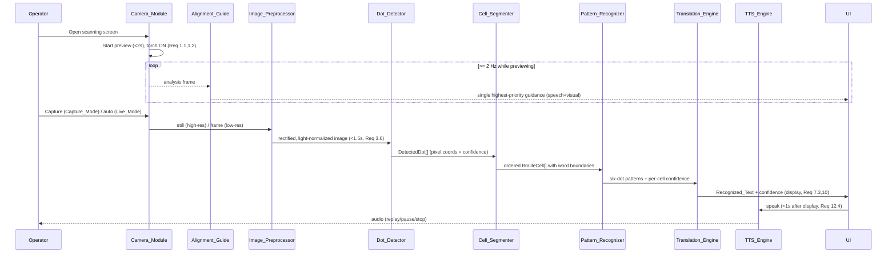

# Design Document

## Overview

The Braille Scanner is a 100% on-device native Android application that converts photographs of real, physical Braille (machine-embossed and handwritten slate-and-stylus) into English text and offline speech. The hard problem is computer vision under everyday conditions, not Unicode translation: the System must coax detectable signal out of white-on-white embossed paper, find the raised dots, group them into cells, recognize patterns, translate with liblouis, and read the result aloud — all offline, forever, with no developer-operated backend.

This document specifies the full pipeline and the surrounding architecture needed to satisfy all 19 requirements.

### Design Goals

The four goals below are ordered. When they conflict, the earlier goal wins.

1. **Accuracy-first (Req 1, 3, 4, 9, 13).** Recognizing real embossed dots is the headline capability. Every camera, lighting, preprocessing, and model decision is made to maximize Character_Accuracy and Cell_Accuracy on the fixed evaluation sets. Raking light is forced on by default; Capture_Mode prioritizes a single high-resolution still over speed.
2. **Offline-forever / no-backend (Req 15, 16, 19).** The model, liblouis tables, and all runtimes are bundled in the APK. The full scan-to-speech cycle runs with the network disabled. No code path contacts a developer-operated server. Cloud features are opt-in, off by default, and never a dependency.
3. **Accessibility-first (Req 2, 14, 17).** The primary user cannot read Braille and may rely on TalkBack or be low-vision. Every instruction is delivered as both speech and on-screen visuals. The whole workflow is operable by Screen_Reader with 48dp targets and 4.5:1 contrast.
4. **Designer-ready (Req 18).** UI structure and component contracts are separated from all visual styling through a centralized design-token Theming_Layer, so a designer can restyle later without touching component logic.

### Honesty about accuracy tiers

The System never overstates confidence. Embossed_Mode is the high-accuracy tier; Handwritten_Mode is explicitly labeled a lower-confidence second tier (Req 9). Grade auto-detection is treated as an estimate with a permanent one-tap override (Req 8). Per-character confidence marking and a per-scan Confidence_Score keep the Operator informed about when to trust the output (Req 10, 13).

### Technology summary and rationale

| Concern | Choice | Rationale |
|---|---|---|
| Language / UI | Kotlin + Jetpack Compose | Compose's declarative composition makes the structure/styling split (Req 18) natural: components read values from a `MaterialTheme`/custom token `CompositionLocal` and never hard-code visuals. Compose also has first-class semantics APIs for TalkBack (Req 17). |
| Camera | CameraX | Stable lifecycle-aware API for torch control (Req 1.2, 1.3, 1.8), focus control (Req 1.4, 1.9), high-res `ImageCapture` (Req 1.5), and an `ImageAnalysis` frame stream for Live_Mode and the Alignment_Guide (Req 2, 12). |
| Vision preprocessing | OpenCV for Android (native `.so`) | Mature document boundary detection, perspective warp, and illumination normalization (Req 3). Solves the embossed shadow extraction problem. |
| Dot detection | Trained object-detection model (YOLO-style / Angelina-Reader-style) exported to TFLite | Real paper under real light needs a learned detector, not thresholding (Req 4). TFLite is the native Android runtime with NNAPI/GPU delegates for the latency budget (Req 12). Bundled in the APK (Req 4.1, 15.4, 19.2). |
| Translation | liblouis compiled via NDK/JNI | Required by Req 7.1; the de-facto Braille translation engine with maintained Grade 1/Grade 2 English tables, bundled as assets (Req 7.4, 15.4). |
| Speech | Android `TextToSpeech` (offline) | Required by Req 11.1/11.7; no network needed, with fallback engine handling (Req 11.4). |

---

## Architecture

### Layering

The app is organized into four layers. Dependencies point downward only; the pipeline and native libraries never reference the UI.

- **UI layer (Jetpack Compose).** Screens, composables, navigation, the Theming_Layer (design tokens), and accessibility semantics. Holds no business logic; renders `ScanResult` state and dispatches Operator intents.
- **Domain layer (Kotlin, pure where possible).** `ScanSession` state machine, `AlignmentEvaluator`, `GradeDetector` heuristic, reading-order/segmentation logic, confidence policy, and the orchestration `ScanCoordinator`. This layer is deterministic and is the primary target of property-based tests.
- **Pipeline layer.** The staged recognition pipeline: `CameraModule` → `ImagePreprocessor` → `DotDetector` → `CellSegmenter` → `PatternRecognizer` → `TranslationEngine` → `TtsEngine`. Each stage has a narrow Kotlin interface so stages can be tested in isolation with fixture images.
- **Native/runtime layer.** OpenCV (`.so`), the TFLite interpreter + delegates and the bundled `.tflite` model, and liblouis (`.so` + JNI bridge) with bundled translation tables. All packaged inside the Application_Package (Req 15.4, 19.2).

```mermaid
graph TD
    subgraph UI["UI Layer — Jetpack Compose"]
        Screens["Scanning / Results / Settings screens"]
        Theme["Theming_Layer (Design_Tokens)"]
        A11y["Accessibility semantics + spoken guidance"]
    end
    subgraph Domain["Domain Layer (pure Kotlin)"]
        Coord["ScanCoordinator (orchestration)"]
        Session["ScanSession state machine"]
        AlignEval["AlignmentEvaluator"]
        Grade["GradeDetector (heuristic)"]
        ConfPolicy["Confidence policy / thresholds"]
    end
    subgraph Pipeline["Pipeline Layer"]
        Cam["Camera_Module (CameraX)"]
        Pre["Image_Preprocessor (OpenCV)"]
        Det["Dot_Detector (TFLite)"]
        Seg["Cell_Segmenter"]
        Pat["Pattern_Recognizer"]
        Trans["Translation_Engine (liblouis)"]
        TTS["TTS_Engine (Android TextToSpeech)"]
    end
    subgraph Native["Native / Bundled Runtimes"]
        OCV["OpenCV .so"]
        TFL["TFLite runtime + .tflite model"]
        LL["liblouis .so + tables"]
        ATTS["Android offline voices"]
    end

    Screens --> Coord
    A11y --> Coord
    Screens --> Theme
    Coord --> Session
    Coord --> AlignEval
    Coord --> Grade
    Coord --> ConfPolicy
    Coord --> Cam
    Cam -->|frames| Pre
    Pre -->|preprocessed image| Det
    Det -->|DetectedDot[]| Seg
    Seg -->|ordered BrailleCell[]| Pat
    Pat -->|patterns + confidence| Trans
    Trans -->|Recognized_Text| Coord
    Coord -->|text| TTS
    Cam -.live frames.-> AlignEval
    Pre --> OCV
    Det --> TFL
    Trans --> LL
    TTS --> ATTS
    Coord -->|ScanResult| Screens
```

### End-to-end data flow



### Two scanning modes vs two scanning profiles

There are two orthogonal axes the design keeps separate:

- **Scanning_Mode (the *what*): Embossed_Mode vs Handwritten_Mode** — selects the detection/preprocessing *parameter set* and the confidence-tier labeling (Req 9). Embossed is default.
- **Capture path (the *how*): Live_Mode vs Capture_Mode** — selects the *frame source and latency budget* (Req 12). Live_Mode streams lower-resolution `ImageAnalysis` frames for sub-second updates; Capture_Mode takes one highest-resolution `ImageCapture` still for best accuracy.

Both axes feed the same pipeline; they only change parameters, frame resolution, and throttling.

### Concurrency model and latency budgets

All capture, preprocessing, inference, segmentation, translation, and TTS run off the main thread on Kotlin coroutine dispatchers; the UI thread only renders state and emits semantics announcements.

- **Camera/analysis threads:** CameraX `ImageAnalysis` runs on its own executor. In Live_Mode the analyzer uses `STRATEGY_KEEP_ONLY_LATEST` plus an explicit in-flight guard so frames are *throttled* — a new frame is dropped if the previous one is still being processed. This bounds load and keeps the live loop responsive.
- **Pipeline dispatcher:** A dedicated `Dispatchers.Default`-backed scope runs the recognition pipeline. Native inference (TFLite) uses NNAPI or GPU delegate when available, falling back to multi-threaded CPU (XNNPACK).
- **Alignment loop:** The `AlignmentEvaluator` runs at ≥2 Hz (Req 2.1) on analysis frames independently of recognition, so guidance never blocks on a slow recognition pass.

Latency budget allocation on the Reference_Device:

| Budget (requirement) | Target | How it is met |
|---|---|---|
| Preview start (Req 1.1) | < 2 s | CameraX bind on screen entry; permission/torch resolved during bind. |
| Live update (Req 12.2) | < 1 s / usable frame | Low-res analysis frames, frame throttling, delegate-accelerated inference, lightweight preprocessing path. |
| Capture → text, embossed (Req 12.3) | < 4 s | Single still: preprocessing ≤ 1.5 s (Req 3.6) + inference + segmentation/translation within remaining budget; processing indicator shown/announced (Req 12.5). |
| TTS start (Req 12.4) | < 1 s after display | TTS engine pre-initialized at screen entry; `speak()` queued immediately on result. |
| Guidance change (Req 2.15) | < 500 ms | ≥2 Hz evaluation + 500 ms reaction path; debounce 750 ms for ready-state (Req 2.10–2.12). |

---

## Components and Interfaces

Each pipeline stage is defined by a narrow interface so it can be unit-tested and fixture-tested in isolation. Interfaces below are illustrative Kotlin signatures.

### Camera_Module (Req 1, 12)

Responsibilities: own the CameraX lifecycle; force Torch on for Raking_Light; maintain close-range focus; provide the live analysis frame stream (Live_Mode) and high-resolution still capture (Capture_Mode); surface hardware-capability and permission errors.

```kotlin
interface CameraModule {
    val previewState: StateFlow<CameraState>          // Starting, Previewing, Error(kind)
    val analysisFrames: Flow<AnalysisFrame>           // low-res stream for Live_Mode + alignment
    fun setTorch(enabled: Boolean)                    // Req 1.3
    fun applyScanningMode(mode: ScanningMode)          // torch/focus policy (Req 1.8)
    suspend fun captureStill(): Result<CapturedImage>  // highest still resolution (Req 1.5)
}
```

Key behaviors:
- On preview start, Torch is enabled by default (Req 1.2) and kept on in Embossed_Mode unless the Operator toggles it off (Req 1.8).
- Focus is constrained to a 5–25 cm working distance using CameraX focus metering / available macro path (Req 1.4).
- Capability/permission failures map to typed `CameraState.Error` kinds: `NoTorch` (Req 1.6), `PermissionDenied` (Req 1.7), `NoMacroFocus` (Req 1.9), `Unavailable` (Req 1.10), `CaptureFailed` (Req 1.11). Each error is delivered to the Operator as both on-screen text and speech, and offers the appropriate recovery control (open settings / retry) while preserving the preview where required.

### Alignment_Guide (Req 2, 14)

Responsibilities: evaluate the live feed for distance, framing, steadiness, lighting, and flatness at ≥2 Hz; emit exactly one prioritized instruction at a time; manage the debounced ready-to-scan state.

```kotlin
data class AlignmentMetrics(
    val documentFillFraction: Float,   // 0..1 of frame area
    val movementPerCycle: Float,       // fraction of frame width
    val luminance: Float,              // normalized 0..1
    val planeTiltDegrees: Float,
    val documentPresent: Boolean
)

sealed interface AlignmentGuidance {
    object MoveCloser; object MoveFarther; object HoldSteady
    object AddLight; object FlattenDocument; object PointAtDocument
    object ReadyToScan
}

interface AlignmentEvaluator {
    fun evaluate(metrics: AlignmentMetrics, nowMs: Long): AlignmentGuidance
}
```

Threshold mapping (directly from Req 2):
- Fill < 25% → MoveCloser (2.2); > 90% → MoveFarther (2.3).
- Movement > 2% frame width/cycle → HoldSteady (2.4).
- Luminance < 20% → AddLight (2.5).
- Plane tilt > 15° → FlattenDocument (2.6).
- No document → PointAtDocument (2.14).
- All thresholds met this cycle → ReadyToScan (2.7).

Prioritization & debounce: when multiple conditions fail, the evaluator surfaces only the one **furthest from its threshold** (2.9). Ready-to-scan is entered only when all pass; it is held through fluctuations shorter than the 750 ms debounce (2.10) and exited when a condition stays out of threshold beyond 750 ms (2.11) or the document leaves the frame within 500 ms (2.12). The state machine always passes through "not ready" before re-announcing readiness (2.13). Every guidance change is both spoken and shown (2.8) and is delivered within 500 ms of a threshold crossing (2.15).

### Image_Preprocessor (Req 3)

Responsibilities: detect the document boundary, perspective-correct to a rectified image, normalize illumination, and hand off to the Dot_Detector within 1.5 s — degrading gracefully when no boundary is found.

```kotlin
data class PreprocessOutput(
    val image: ImageBuffer,            // normalized image in detector input space
    val rectified: Boolean,            // false => perspective correction skipped (Req 3.5)
    val documentQuadInPixels: Quad?    // boundary used, if any
)

interface ImagePreprocessor {
    suspend fun process(input: CapturedImage, mode: ScanningMode): PreprocessOutput
}
```

The **embossed white-on-white shadow problem**: embossed dots are the same color as the paper, so under flat lighting they are nearly invisible. The design attacks this with two cooperating mechanisms:
1. **Raking light at capture (Camera_Module).** The Torch held at a low/grazing angle makes each raised dot cast a small directional shadow with a bright leading edge — converting height into a luminance signal the model can learn.
2. **Illumination normalization (OpenCV).** Because raking light is intrinsically uneven (brighter near the LED), the preprocessor applies background illumination estimation and division / CLAHE-style local contrast normalization so the dot-vs-shadow micro-contrast is preserved while the global gradient is flattened (Req 3.3). Perspective correction (Req 3.2) is applied first when a boundary is found so the dot grid is axis-aligned, which materially improves both detection and 2×3 segmentation.

When no boundary is detected, the preprocessor still normalizes lighting, passes the unrectified frame on, and records `rectified=false` so downstream confidence and diagnostics account for the skipped correction (Req 3.5). The 1.5 s budget (Req 3.6) is held by running OpenCV natively and capping boundary-search resolution.

### Dot_Detector (Req 4)

Responsibilities: run the bundled object-detection model on the preprocessed image and output every dot (or cell) detection whose confidence meets the minimum threshold, in pixel coordinates referenced to the preprocessed image, each with a Confidence_Score.

```kotlin
data class DetectorParams(           // one set per Scanning_Mode (Req 4.4, 9.3)
    val minDotConfidence: Float,
    val spacingTolerance: Float,
    val depthTolerance: Float
)

interface DotDetector {
    suspend fun detect(image: ImageBuffer, params: DetectorParams): DotDetectionResult
}

data class DotDetectionResult(
    val dots: List<DetectedDot>,         // pixel coords + confidence (Req 4.3, 4.7)
    val structureInferable: Boolean      // any Braille-like spatial structure? (Req 4.5, 4.6)
)
```

The detector executes entirely on-device on the bundled TFLite runtime (Req 4.1, 4.2). In Handwritten_Mode it applies the Handwritten parameter set that tolerates irregular spacing and variable dot depth (Req 4.4). The `structureInferable` flag plus the downstream segmentation result lets the System distinguish three failure cases required by Req 4.5/4.6/14: (a) structure inferable but no valid cell → prompt to adjust alignment/lighting/distance before a full rescan (4.5); (b) no usable candidates or no inferable structure → "no Braille recognized," prompt rescan (4.6, 14.1).

### Cell_Segmenter (Req 5)

Responsibilities: cluster accepted dots into 2×3 cells, assign each accepted dot to at most one cell, drop noise, group cells into lines, order them, and insert word boundaries.

```kotlin
interface CellSegmenter {
    fun segment(dots: List<DetectedDot>): SegmentedDocument  // ordered lines of cells
}
```

Algorithm and thresholds (from Req 5):
1. **Cell grid clustering.** Estimate the dot pitch from nearest-neighbor spacing; fit candidate 2-column × 3-row grids; assign each accepted dot to exactly one cell's six candidate positions; exclude dots that fit no cell as noise (5.1).
2. **Line grouping.** Compute median cell height; group cells whose vertical centers lie within half the median cell height into a common line (5.2).
3. **Reading order.** Within a line order cells left→right by horizontal position; order lines top→bottom (5.3).
4. **Word boundaries.** Compute the median intra-line cell-to-cell spacing; insert a word boundary wherever an adjacent gap exceeds 1.5× that median (5.4).
5. **Degraded regions.** A region whose dots cannot form a valid 2×3 grid gets a Confidence_Score below the cell-confidence threshold, and segmentation continues on remaining regions (5.5).
6. **Empty input.** No dots → an empty ordered set of cells (5.6).

### Pattern_Recognizer (Req 6)

Responsibilities: map each segmented cell to its six-dot pattern, assign a per-cell Confidence_Score, and flag low-confidence cells as uncertain.

```kotlin
interface PatternRecognizer {
    fun recognize(doc: SegmentedDocument): List<RecognizedCell>
}
data class RecognizedCell(
    val dots: BrailleDots,        // which of 6 positions are raised
    val confidence: Confidence,
    val uncertain: Boolean        // confidence < cell-confidence threshold (Req 6.3)
)
```

Each of the six positions is marked raised/not-raised from the assigned detections; the cell confidence aggregates the constituent dot confidences and the grid-fit quality (6.1, 6.2). Cells below the cell-confidence threshold are flagged uncertain (6.3), which downstream drives both the per-character display marking (Req 10.3) and the overall scan confidence.

### Translation_Engine (Req 7)

Responsibilities: translate the recognized six-dot patterns to English using on-device liblouis with bundled Grade 1 and Grade 2 English tables, and report untranslatable cells.

```kotlin
interface TranslationEngine {
    fun translate(cells: List<RecognizedCell>, grade: Grade): TranslationOutput
}
data class TranslationOutput(
    val text: String,
    val charSpans: List<CharSpan>,         // map each output char back to source cell(s)
    val untranslatableCells: List<CellRef> // Req 7.5
)
```

liblouis is compiled for Android and invoked over JNI (see "Native library integration"). It supports both Grade 1 (uncontracted) and Grade 2 (contracted) English (7.2) using only bundled tables (7.4). The `charSpans` mapping is essential: it lets the System propagate per-cell confidence to per-character display marking (Req 10.3) even though Grade 2 contractions make the cell→character mapping non-1:1. Untranslatable cells are surfaced with their raw patterns and an explanatory message (7.5).

### Grade_Detector (Req 8)

Responsibilities: when Grade_Mode is Auto, estimate Grade 1 vs Grade 2 from the recognized patterns and select that grade; always defer to a one-tap manual override.

```kotlin
interface GradeDetector {
    fun estimate(cells: List<RecognizedCell>): Grade   // Grade1 | Grade2
}
```

The heuristic is explicitly an **estimate** (8.5). It scores the presence of cells/sequences that are only meaningful in contracted Braille (contraction indicators, whole-word signs, common contraction cells) against a Grade-1-only interpretation; if contraction signals exceed a threshold it selects Grade 2, else Grade 1. The selected grade is displayed (8.2). A one-tap control overrides to Grade 1 or Grade 2 (8.3); on override the Translation_Engine **re-translates the current patterns** with the chosen grade and the display updates (8.4). The honesty disclaimer is shown beside the control (8.5), and Grade_Mode defaults to Auto each session (8.6). Critically, override re-translation does **not** require re-scanning — it reruns only translation on the already-recognized cells.

### TTS_Engine (Req 11, 12)

Responsibilities: speak Recognized_Text offline; offer replay/pause/stop; fall back to another offline engine; handle missing voice data.

```kotlin
interface TtsEngine {
    suspend fun prepare(): TtsReadiness     // NoVoiceData | Ready(engineId)
    fun speak(text: String)
    fun replay(); fun pause(); fun stop()
}
```

Uses Android `TextToSpeech` offline by default (11.1, 11.7), starting within 1 s of display by pre-initializing at screen entry (12.4). If the default engine is unavailable/inadequate it falls back to another installed offline engine (11.4). If no offline voice data exists, it shows a message, announces it if any audio path exists, and offers a control to open device TTS settings (11.5) while letting any already-playing audio continue (11.6). An approved Cloud_Speech_Service may *enhance* speech only when the network is available and the Operator enabled cloud features, and is never required (11.8).

### Results / Output presentation (Req 10, 13)

Responsibilities: render Recognized_Text with uncertain characters visually marked, show the per-scan Confidence_Score, provide copy-to-clipboard, and retain results if the display is unavailable.

The results composable renders text using only Design_Tokens (10.5), marks each character whose confidence is below the display-confidence threshold (10.3) using the `charSpans` mapping, shows the scan Confidence_Score (10.2, 13.9), and exposes a copy control (10.4). If the display is unavailable when text is produced, recognition still completes and the result is retained for later presentation (10.6).

### Theming_Layer (Req 18)

Responsibilities: define every color, typography, and spacing value as a Design_Token in one place; expose tokens to components via Compose `CompositionLocal`s; forbid hard-coded visuals in components.

```kotlin
data class ColorTokens(/* semantic roles: surface, onSurface, accent, uncertainMark, ... */)
data class TypographyTokens(/* role-based text styles */)
data class SpacingTokens(/* xs, s, m, l, xl, touchTargetMin = 48.dp */)

val LocalColorTokens = staticCompositionLocalOf<ColorTokens> { error("not provided") }
// components read e.g. LocalColorTokens.current.accent — never Color(0xFF...)
```

Design-readiness mechanics:
- Tokens are **semantic** (role-named: `accent`, `uncertainMark`, `surface`) not literal, so restyling means editing token values, not components.
- Components consume tokens **exclusively** through the layer (18.2); a lint rule / code-review checklist bans raw `Color(...)`, hard-coded `.sp`, and hard-coded `.dp` outside the token definitions (18.3).
- Because composables only reference token names, changing a token value reflows every consumer with no structural change (18.4).
- Component **structure and contracts** (parameters, slots, semantics) live separately from the token definitions (18.5), so a designer swaps the token set (and can provide light/dark/high-contrast variants) without rearchitecting.
- The high-contrast theme (Req 17.7) is simply an alternate `ColorTokens` instance — same components, different token values.

### Accessibility design (Req 14, 17)

Accessibility is a cross-cutting concern implemented in the UI layer and the guidance/error pipeline:
- Full Screen_Reader operability end to end (17.1); every interactive control has a descriptive `contentDescription`/semantics label (17.2).
- Primary actions are ≥ 48×48 dp via the `SpacingTokens.touchTargetMin` token (17.3).
- Text and essential UI meet ≥ 4.5:1 contrast, enforced through the token palette and a contrast check in design review (17.4); a dedicated high-contrast theme is provided (17.7).
- Spoken voice guidance covers the primary scanning workflow (17.5, plus Req 2 guidance and Req 9.6 handwritten-tier notice).
- Processing-state changes are announced via Compose `liveRegion`/`announceForAccessibility` (17.6, 12.5).
- The dual-delivery rule (speech + on-screen) for all guidance, errors, and low-confidence messages is centralized in a `Notifier` so no message can ship as visual-only or audio-only, and it degrades to whichever channel is available (Req 14.5, 14.6, 1.6, 1.9, 1.10, 1.11).

### Privacy & cloud boundary (Req 15, 16)

- Frames live in memory only; nothing is written to storage unless the Operator explicitly saves a scan (16.1, 16.2).
- There is **no developer backend** and no code path that contacts one (15.3, 15.6). Network-free operation is verified by the offline test suite (15.2).
- Cloud features (optional speech/recognition boost) are compiled behind an explicit, default-off opt-in; with cloud disabled the entire scan-to-speech cycle works (15.5). When enabled, opt-in is required before any image leaves the device (16.3), local temporary copies of transmitted images are deleted after transmission (16.4), only providers with documented retention controls are used (16.4), and institutional approval is required before cloud processing of saved scans (16.5).

### Installation & bundling (Req 19)

The Application_Package is a single installable APK / Play Internal Testing build (19.1) that bundles the `.tflite` model, OpenCV and liblouis native libraries, the liblouis tables, and the TFLite runtime as assets/jniLibs (19.2, 15.4) — no post-install downloads. On a supported device it launches to the scanning screen with no developer server available (19.3). Camera and other runtime permissions are requested at first use with plain-language rationale (19.4).

---

## Data Models

```kotlin
// A normalized confidence value in [0,1]. Construction clamps/validates the range.
@JvmInline value class Confidence(val value: Float) {
    init { require(value in 0f..1f) }
}

enum class ScanningMode { EMBOSSED, HANDWRITTEN }     // Req 9
enum class CaptureMode  { LIVE, CAPTURE }             // Req 12
enum class Grade        { GRADE_1, GRADE_2 }          // resolved grade
enum class GradeMode     { AUTO, GRADE_1, GRADE_2 }    // Operator setting (Req 8)

// Output of the Dot_Detector — pixel coords referenced to the preprocessed image (Req 4.3, 4.7)
data class DetectedDot(
    val x: Float, val y: Float,        // pixel center in preprocessed-image space
    val radius: Float,
    val confidence: Confidence
)

// One of the 6 positions in a Braille cell (columns 1-2, rows 1-3)
data class BrailleDots(val raised: Set<Int>) {        // subset of {1,2,3,4,5,6}
    init { require(raised.all { it in 1..6 }) }
}

// A segmented cell occupying a single 2x3 grid (Req 5.1)
data class BrailleCell(
    val dots: List<DetectedDot>,       // assigned dots (<= 6)
    val boundingBox: RectF,
    val centerY: Float,
    val validGrid: Boolean,            // false => degraded region (Req 5.5)
    val confidence: Confidence
)

// Ordered structure produced by the Cell_Segmenter (Req 5.2-5.4)
data class TextLine(val cells: List<BrailleCell>, val wordBoundaryAfter: Set<Int>)
data class SegmentedDocument(val lines: List<TextLine>)   // reading order top->bottom

// Recognized cell (Req 6)
data class RecognizedCell(
    val source: BrailleCell,
    val dots: BrailleDots,
    val confidence: Confidence,
    val uncertain: Boolean             // confidence < cell-confidence threshold (Req 6.3)
)

// Maps an output character span back to source cell(s) for confidence marking (Req 10.3)
data class CharSpan(val startIndex: Int, val endIndex: Int, val cellRefs: List<Int>, val confidence: Confidence)

// The result of a completed scan
data class ScanResult(
    val recognizedText: String,
    val charSpans: List<CharSpan>,
    val overallConfidence: Confidence,           // per-scan score (Req 10.2, 13.9)
    val scanningMode: ScanningMode,
    val resolvedGrade: Grade,
    val gradeMode: GradeMode,
    val gradeWasAutoDetected: Boolean,           // Req 8.2
    val untranslatableCells: List<Int>,          // Req 7.5
    val perspectiveCorrected: Boolean,            // Req 3.5 provenance
    val status: ScanStatus
)

sealed interface ScanStatus {
    object Success
    object NoBrailleRecognized                    // Req 4.6, 14.1
    object StructureButNoCell                     // Req 4.5
    data class LowConfidence(val likelyCause: AlignmentGuidance) : ScanStatus  // Req 14.2
    data class ProcessingError(val message: String) : ScanStatus               // Req 14.3
}

// Centralized, documented thresholds (single source of truth for the confidence policy)
data class ConfidenceThresholds(
    val minDotDetection: Float,        // Req 4.3
    val cellConfidence: Float,         // Req 5.5, 6.3
    val displayConfidence: Float,      // Req 10.3
    val rescanRecommendation: Float    // Req 14.2
)
```

These thresholds and the spacing constants (half median cell height for lines; 1.5× median spacing for word boundaries; 5–25 cm distance; 25%/90% fill; 2% movement; 20% luminance; 15° tilt; 750 ms debounce; 500 ms reaction) are defined once in a configuration object so the policy is applied consistently everywhere (supports Req 2, 5, 14).

---

## Correctness Properties

*A property is a characteristic or behavior that should hold true across all valid executions of a system — essentially, a formal statement about what the system should do. Properties serve as the bridge between human-readable specifications and machine-verifiable correctness guarantees.*

The properties below were derived from the acceptance criteria via the prework analysis and consolidated to remove redundancy. Criteria that are timing/latency (Req 1.1, 1.4, 2.1, 2.15, 3.6, 12.2–12.4), accuracy-dataset gates (Req 13.1–13.6), packaging/architectural facts (Req 4.1–4.2, 7.1, 7.4, 15.1, 15.4, 18.1–18.3, 18.5, 19.1–19.2), specific UI interactions, and pure error-branch examples are validated by integration, smoke, or example tests in the Testing Strategy rather than by property-based tests.

### Property 1: Alignment guidance selects a single furthest-from-threshold instruction

*For any* `AlignmentMetrics`, the `AlignmentEvaluator` returns exactly one `AlignmentGuidance`; if any condition is out of threshold the returned guidance corresponds to the condition with the greatest normalized distance past its threshold, and if no document is present the guidance is `PointAtDocument`.

**Validates: Requirements 2.2, 2.3, 2.4, 2.5, 2.6, 2.9, 2.14**

### Property 2: Ready-to-scan is announced only when all thresholds pass

*For any* `AlignmentMetrics` in which distance, framing, steadiness, lighting, and flatness all satisfy their thresholds, the evaluator returns `ReadyToScan`.

**Validates: Requirements 2.7**

### Property 3: Ready-state debounce and re-announcement

*For any* time-ordered sequence of alignment evaluations driven by a virtual clock, the ready-to-scan state is maintained through out-of-threshold bursts shorter than the 750 ms debounce, is left when a condition stays out of threshold beyond 750 ms, and every `ReadyToScan` announcement is preceded by an intervening non-ready state (no two consecutive readiness announcements without leaving ready in between).

**Validates: Requirements 2.10, 2.11, 2.13**

### Property 4: Perspective correction aligns document edges within tolerance

*For any* synthetic rectangular document warped by a randomly generated valid homography, applying boundary detection and perspective correction yields a rectified image whose document edges are aligned to the image axes within the defined edge-alignment tolerance.

**Validates: Requirements 3.2**

### Property 5: Lighting normalization reduces illumination variation below threshold

*For any* base image with a randomly generated smooth illumination gradient applied, the variation in illumination across the normalized output is reduced to within the defined illumination-uniformity threshold.

**Validates: Requirements 3.3**

### Property 6: Missing boundary degrades gracefully with recorded provenance

*For any* captured frame in which no document boundary can be detected, the `Image_Preprocessor` still produces a lighting-normalized image, sets `rectified = false`, and records that perspective correction was skipped.

**Validates: Requirements 3.5**

### Property 7: Detector output is well-formed

*For any* `DotDetectionResult` after policy filtering, every returned `DetectedDot` has a `Confidence` within [0,1] that meets or exceeds `minDotDetection`, and every dot's (x, y) coordinate lies within the bounds of the preprocessed image.

**Validates: Requirements 4.3, 4.7**

### Property 8: Scanning-mode parameter selection

*For any* selected `ScanningMode`, the `DetectorParams` (and preprocessing parameters) passed to subsequent scans are exactly the parameter set associated with that mode; in particular Handwritten_Mode supplies the irregular-spacing/variable-depth parameter set.

**Validates: Requirements 4.4, 9.3**

### Property 9: Recognition outcome classification

*For any* combination of dot candidates and segmentation result: if there are no usable dots or no inferable Braille-like structure, the resulting `ScanStatus` is `NoBrailleRecognized`; if structure is inferable but no valid 2×3 cell can be formed, the status is `StructureButNoCell`; otherwise recognition proceeds.

**Validates: Requirements 4.5, 4.6, 14.1**

### Property 10: Segmentation assigns each accepted dot to at most one cell

*For any* set of detected dots, each accepted dot used for recognition is assigned to at most one `BrailleCell`, every formed cell occupies a single 2-column × 3-row grid of at most six dot positions, and dots that fit no cell are excluded as noise.

**Validates: Requirements 5.1**

### Property 11: Reading-order and line-grouping monotonicity

*For any* `SegmentedDocument`, cells whose vertical centers lie within half the median cell height are grouped into a common line; within each line cell horizontal positions are non-decreasing left-to-right; and line vertical centers are non-decreasing top-to-bottom.

**Validates: Requirements 5.2, 5.3**

### Property 12: Word boundaries at gaps beyond 1.5× median spacing

*For any* line of cells, a word boundary is inserted between two adjacent cells if and only if the horizontal gap between them exceeds 1.5 times the median intra-line cell-to-cell spacing of that line.

**Validates: Requirements 5.4**

### Property 13: Invalid grid regions get sub-threshold confidence without halting segmentation

*For any* document containing both valid and invalid (non-2×3-formable) regions, every invalid region is assigned a `Confidence` below the cell-confidence threshold and all remaining valid regions are still segmented and produced.

**Validates: Requirements 5.5**

### Property 14: Pattern recognition maps cells to valid six-dot patterns

*For any* segmented cell with a known set of raised positions, the `Pattern_Recognizer` returns a `BrailleDots` whose raised set is a subset of {1,2,3,4,5,6} and reflects the assigned dot positions.

**Validates: Requirements 6.1**

### Property 15: Cell confidence is total and the uncertain flag is consistent

*For any* `SegmentedDocument`, every `RecognizedCell` has a `Confidence` in [0,1], and its `uncertain` flag is true if and only if that confidence is below the cell-confidence threshold.

**Validates: Requirements 6.2, 6.3**

### Property 16: Translation round-trip preserves text

*For any* text drawn from a representative English corpus, encoding it to Braille cells and back-translating with liblouis reproduces the original text (modulo defined normalization) for both Grade 1 and Grade 2 tables.

**Validates: Requirements 7.2**

### Property 17: Untranslatable cells are reported exactly

*For any* set of recognized cells that includes cells liblouis cannot translate, the `TranslationOutput.untranslatableCells` contains exactly those cells and a corresponding "could not translate" message is generated.

**Validates: Requirements 7.5**

### Property 18: Grade override always re-translates current patterns without rescanning

*For any* set of already-recognized patterns and any Operator-selected override grade, the updated Recognized_Text equals `translate(patterns, overrideGrade)` and is produced by re-running only translation — no new capture, detection, or segmentation occurs. When Grade_Mode is Auto, the detector always resolves to exactly Grade 1 or Grade 2.

**Validates: Requirements 8.1, 8.4**

### Property 19: Handwritten results are always labeled lower-confidence

*For any* `ScanResult` produced while `ScanningMode` is Handwritten_Mode, every rendering of the result includes the lower-confidence second-tier label.

**Validates: Requirements 9.5**

### Property 20: Every completed scan exposes a per-scan confidence score

*For any* successful `ScanResult`, an `overallConfidence` in [0,1] is present and surfaced for display.

**Validates: Requirements 10.2, 13.9**

### Property 21: Per-character uncertainty marking matches the threshold

*For any* Recognized_Text with associated `charSpans`, the exact set of characters marked uncertain equals the set of characters whose confidence is below the display-confidence threshold.

**Validates: Requirements 10.3**

### Property 22: Recognition completes and is retained when the display is unavailable

*For any* scan whose Recognized_Text is produced while the display is unavailable, recognition still completes and the resulting `ScanResult` is retained for presentation when the display becomes available.

**Validates: Requirements 10.6**

### Property 23: Accuracy metric correctness

*For any* pair of (recognized, ground-truth) strings, the computed Character_Accuracy equals 1 minus the character error rate, lies within [0,1], equals 1.0 when the strings are identical, and handles empty-string cases without error.

**Validates: Requirements 13.7**

### Property 24: Low-confidence scans recommend rescan with a likely cause

*For any* `ScanResult` whose `overallConfidence` is below the rescan-recommendation threshold, the status is `LowConfidence` carrying a likely-cause derived from the failed alignment condition, and a rescan recommendation is produced.

**Validates: Requirements 14.2**

### Property 25: Every failure or low-confidence condition produces a message

*For any* non-success `ScanStatus`, the `Notifier` produces a corresponding non-empty failure or low-confidence message.

**Validates: Requirements 14.4**

### Property 26: Messages are delivered on both channels, degrading to whichever is available

*For any* guidance, failure, or low-confidence message, when both channels are available the `Notifier` produces both a spoken-audio artifact and an on-screen visual artifact; when exactly one channel is available the message is still delivered through that channel.

**Validates: Requirements 2.8, 14.5, 14.6**

### Property 27: Full scan-to-speech cycle works offline with cloud disabled

*For any* scan operation executed with the network disabled and cloud features off (the default), the complete cycle — capture, preprocessing, detection, segmentation, recognition, translation, and offline speech — completes successfully without any cloud call.

**Validates: Requirements 11.8, 15.2, 15.5**

### Property 28: The System never contacts a developer-controlled backend

*For any* operation or sequence of operations — whether cloud features are disabled or enabled — the number of network requests targeting a developer-controlled backend host is zero; any outbound requests (only when cloud is enabled) target solely the approved third-party allowlist.

**Validates: Requirements 15.3, 15.6**

### Property 29: Camera frames are persisted only on explicit save

*For any* sequence of scans, a captured frame is written to device storage if and only if the Operator explicitly requested to save that scan; otherwise frames remain in memory only.

**Validates: Requirements 16.1, 16.2**

### Property 30: Cloud transmission is gated by opt-in and cleaned up afterward

*For any* attempt to transmit image data, the transmission is blocked unless the explicit cloud opt-in is set; and for any image that is transmitted, the local temporary copy is deleted after transmission completes and the destination belongs to the approved-provider allowlist.

**Validates: Requirements 16.3, 16.4**

### Property 31: Every interactive control has a descriptive accessibility label

*For any* screen in the app, every UI node exposing a click/interaction action has a non-empty, descriptive accessibility (semantics) label.

**Validates: Requirements 17.2**

### Property 32: Primary action controls meet the minimum touch-target size

*For any* primary action control rendered by the UI, its measured width and height are each at least 48 density-independent pixels.

**Validates: Requirements 17.3**

### Property 33: Text and essential elements meet the contrast ratio

*For any* (foreground, background) Design_Token pair used for text or essential UI, the computed contrast ratio is at least 4.5:1 (evaluated for both the default and high-contrast themes).

**Validates: Requirements 17.4, 17.7**

### Property 34: Every processing-state change is announced

*For any* transition of the processing state, exactly one Screen_Reader announcement describing the new state is emitted.

**Validates: Requirements 17.6, 12.5**

### Property 35: Design-token changes propagate to all consumers without structural change

*For any* Design_Token and any new value provided through the Theming_Layer, every component that consumes that token renders with the new value, and the component tree structure is unchanged by the value swap.

**Validates: Requirements 18.4**

---

## Error Handling

Errors are modeled explicitly and always surfaced through the centralized `Notifier`, which guarantees the dual-channel (speech + on-screen) delivery and degradation rules of Req 14.5/14.6 (Property 26). The strategy maps each requirement error condition to a typed outcome and a recovery affordance.

### Camera and hardware errors (Req 1.6, 1.7, 1.9, 1.10, 1.11)

| Condition | Typed outcome | Operator-facing behavior |
|---|---|---|
| No controllable Torch | `CameraState.Error(NoTorch)` | Inform (text+speech) that external low-angle lighting is required; scanning continues. |
| Camera permission denied | `CameraState.Error(PermissionDenied)` | Inform (text+speech); provide control to open permission settings. |
| No macro/close focus | `CameraState.Error(NoMacroFocus)` | Inform (text+speech) close-range focus unavailable; scanning continues. |
| Camera unavailable (non-permission) | `CameraState.Error(Unavailable)` | Inform (text+speech); provide retry control. |
| Capture fails | `CameraState.Error(CaptureFailed)` | Inform (text+speech); preserve live preview; allow retry. |

### Pipeline / recognition outcomes (Req 4.5, 4.6, 14.1–14.4)

The `ScanCoordinator` reduces pipeline output to a `ScanStatus`:
- `NoBrailleRecognized` — no usable dots or no inferable structure (Property 9): "No Braille was recognized," offer rescan.
- `StructureButNoCell` — structure present but no valid cell (Property 9): prompt to adjust alignment/lighting/distance before requesting a full rescan.
- `LowConfidence(likelyCause)` — overall confidence below rescan threshold (Property 24): recommend rescan and state the likely cause from the failed alignment condition.
- `ProcessingError(message)` — unexpected exception anywhere in the pipeline (Req 14.3): catch, return to the scanning screen, and inform the Operator the scan could not be completed. The pipeline is wrapped so no uncaught exception can crash the scanning session.

### Translation and TTS errors (Req 7.5, 11.4, 11.5, 11.6)

- Untranslatable cells: display the raw cell patterns and inform the Operator those cells could not be translated (Property 17).
- TTS default engine unavailable/inadequate: fall back to another installed offline engine (Req 11.4).
- No offline voice data: show a message, announce it if any audio path exists, and offer a control to open device TTS settings (Req 11.5); audio already playing keeps playing (Req 11.6).

### Display unavailability (Req 10.6)

If the display is unavailable when text is produced, recognition completes anyway and the `ScanResult` is retained for later presentation (Property 22).

### Threshold consistency

All thresholds (dot-detection, cell-confidence, display-confidence, rescan-recommendation) and spacing/timing constants live in a single configuration object so error and low-confidence decisions are applied consistently across the pipeline and the UI.

---

## Testing Strategy

The strategy is a dual approach: **property-based tests** verify the universal invariants above across many generated inputs, while **unit, fixture, integration, smoke, and accessibility tests** cover concrete examples, hardware behavior, packaging facts, and the on-device accuracy gates. Property-based testing is appropriate here because the domain layer (segmentation, reading order, word boundaries, confidence policy, grade override, notification, accuracy metric) is deterministic pure-Kotlin logic with large input spaces; it is **not** appropriate for camera/timing behavior, model accuracy gates, IaC-like packaging facts, or pixel-level UI rendering, which use the alternative strategies below.

### Property-based tests

- **Library:** kotest-property (or jqwik) for JVM/Kotlin domain logic.
- **Iterations:** each property test runs a minimum of 100 generated cases.
- **Tagging:** each test is tagged with a comment in the format **Feature: braille-scanner, Property {number}: {property_text}** referencing the property it implements.
- **One test per property:** each of Properties 1–35 is implemented by a single property-based test with a tailored generator:
  - Alignment metrics generators (fill fraction, movement, luminance, tilt, presence) for Properties 1–3, plus a virtual-clock event-sequence generator for the debounce state machine (Property 3).
  - Synthetic-document + random-homography and random-illumination-gradient generators for the OpenCV preprocessing Properties 4–6 (run on the JVM via OpenCV Java bindings or on-device instrumented where required).
  - Detected-dot-cloud generators (including noise, irregular spacing, and empty input) for the detector-output and segmentation Properties 7, 10–13.
  - Cell/pattern generators for recognition Properties 14, 15.
  - English-corpus generators for the translation round-trip Property 16 and untranslatable-cell Property 17.
  - Pattern + grade generators for the grade-override Property 18.
  - `ScanResult`/`ScanStatus` generators for Properties 9, 19–25.
  - Network-layer and persistence fakes for the offline/no-backend/privacy Properties 27–30 (assert request counts and file-write counts over generated operation sequences).
  - Compose semantics-tree and token generators for accessibility/theming Properties 31–35.

### Unit and example tests

Concrete-example coverage for the criteria classified as EXAMPLE/EDGE_CASE: torch default/toggle and capture-resolution selection (Req 1.2, 1.3, 1.5, 1.8) against a fake CameraX controller; each camera/TTS error branch (Req 1.6–1.11, 11.4–11.6); empty-input segmentation (Req 5.6); grade/mode defaults and controls (Req 8.2, 8.3, 8.5, 8.6, 9.1, 9.2, 9.4, 9.6, 9.7); copy-to-clipboard and results rendering (Req 7.3, 10.1, 10.4); processing-error return-to-scanning (Req 14.3); institutional-approval gate (Req 16.5); permission rationale flow (Req 19.4); unprovided-token failure (Req 18.3).

### Pipeline component tests with fixture images

Each pipeline stage is exercised against a small set of version-controlled fixture images with known ground truth: boundary detection encloses the expected area (Req 3.1), the detector emits expected dots on clean fixtures, and the segmenter/recognizer produce expected cells. Fixtures include the embossed white-on-white shadow case and a handwritten case.

### Accuracy harness (Req 13)

A repeatable harness runs the full pipeline over the fixed, version-controlled **Embossed_Evaluation_Set** and **Handwritten_Evaluation_Set**, computing Character_Accuracy (1 − CER) and Cell_Accuracy per item and in aggregate, then asserting against the gates:
- Embossed MVP: ≥85% Character_Accuracy **and** ≥90% Cell_Accuracy (Req 13.2); Embossed Production: ≥95% **and** ≥98% (Req 13.1, 13.3).
- Handwritten MVP: ≥50% Character_Accuracy (Req 13.5); Handwritten Production: ≥70% (Req 13.4).
The evaluation sets are checksum-pinned in version control for repeatability (Req 13.8). The metric function itself is independently verified by Property 23.

### Integration and timing tests (Reference_Device)

Instrumented tests on the Reference_Device validate the latency budgets and hardware behavior that property tests cannot: preview start <2 s (Req 1.1), focus working distance (Req 1.4), alignment cadence ≥2 Hz and ≤500 ms reaction (Req 2.1, 2.15), preprocessing ≤1.5 s (Req 3.6), Live update <1 s (Req 12.2), Capture→text <4 s (Req 12.3), TTS start <1 s (Req 12.4), and offline launch to scanning screen (Req 19.3).

### Smoke / packaging tests

Build-time and launch-time checks for packaging and architecture facts: model, liblouis tables, OpenCV/TFLite/liblouis runtimes are bundled with no post-install download path (Req 4.1, 4.2, 7.1, 7.4, 15.1, 15.4, 19.1, 19.2); design-token lint rule bans hard-coded visuals in components and enforces the structure/styling separation (Req 18.1, 18.2, 18.5).

### Accessibility testing

Automated Espresso + Accessibility Test Framework traversal plus manual TalkBack testing verify end-to-end Screen_Reader operability (Req 17.1) and spoken workflow guidance (Req 17.5), complementing the per-node property tests for labels, touch targets, and contrast (Properties 31–33) and state-change announcements (Property 34). Full WCAG-style validation requires manual testing with assistive technologies and expert review.

---

## Limitations and Risks

The design is honest about where accuracy and reliability are constrained:

- **Handwritten accuracy and data.** Slate-and-stylus Braille has irregular spacing and variable dot depth, and there is no large public handwritten dataset comparable to DSBI/Angelina for embossed. Handwritten_Mode is a clearly labeled second tier (Req 9.5/9.6) with lower targets (50% MVP / 70% Production, Req 13.4/13.5). Reaching even these likely requires **collecting and labeling a dedicated handwritten dataset**; until then handwritten output should be treated as assistive, not authoritative.
- **Grade auto-detection is heuristic.** Distinguishing Grade 1 from Grade 2 from recognized cells alone is inherently ambiguous on short or atypical samples. It is presented as an estimate with a permanent one-tap override and instant re-translation (Req 8, Property 18); the override is the reliability backstop, not the heuristic.
- **Device camera variability.** Macro focus quality, torch brightness, and sensor resolution vary widely across Android devices. Raking-light effectiveness depends on torch geometry, which differs per device. The 5–25 cm working distance, alignment guidance, and graceful no-torch/no-macro degradation (Req 1.6, 1.9) mitigate this, but accuracy targets are defined against a specific Reference_Device and may not hold on low-end hardware.
- **Model size vs accuracy tradeoff.** The detector must be bundled in the APK and run within the latency budgets on-device. Larger, more accurate models increase APK size and inference time; the two-tier parameterization, delegate acceleration (NNAPI/GPU), and frame throttling in Live_Mode are the levers used to balance this. Live_Mode favors speed and is expected to be less accurate than Capture_Mode, which is why Capture_Mode is the path tied to the embossed accuracy gates.
- **Embossed white-on-white remains the hardest CV problem.** Even with raking light and normalization, very shallow or flattened dots, glossy paper, or poor ambient geometry can suppress the shadow signal. The alignment guidance and low-confidence/rescan flow (Req 2, 14) are the primary defenses, surfacing the likely cause so the Operator can correct conditions.
- **Preprocessing on the JVM vs device.** Some OpenCV property tests (Properties 4–5) run against the Java bindings on the JVM for speed; behavior is re-validated on-device via fixture and integration tests because native delegate/codec differences can affect results.
